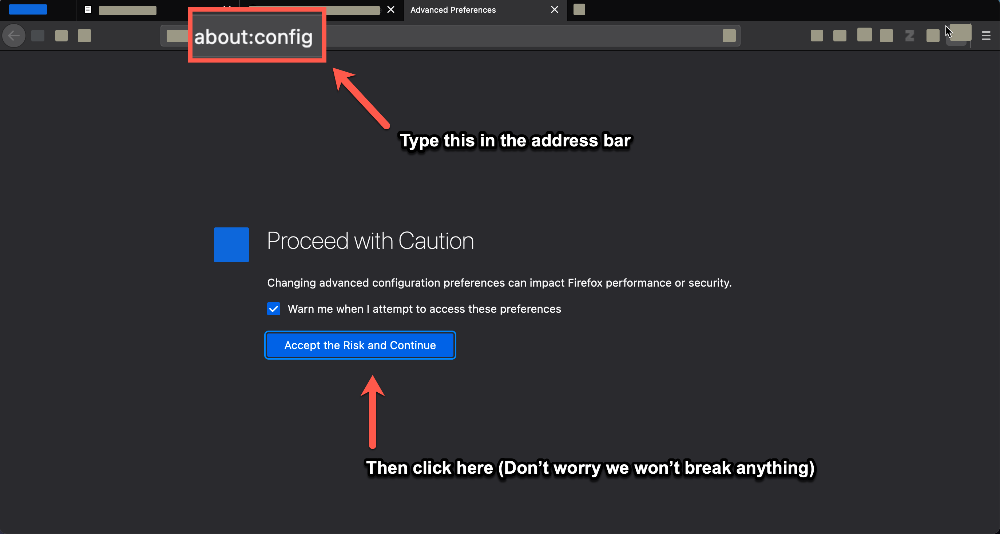
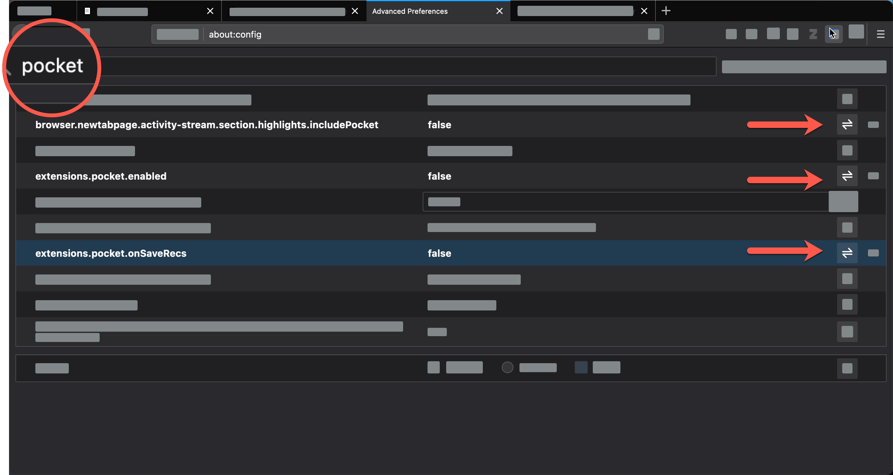

# Remove Pocket from Firefox

If you are using Firefox, you will need to disable the Pocket integration. We've put together a little tutorial for how to do this on your own. If you run into any problems, please feel free to call the IT help desk at extension 1111. They will be happy to assist you.

## Step 1

Open a new tab and enter __about:config__ in the address bar at the top of the page. A window will pop up with a warning. Click the __Accept the Risk and Continue__ button.

## Step 2

In the search bar at the top of the page, type in __pocket__. Then click the __toggle button__ in the far right column next to each of the following items:

  - browser.newtabpage.activity-stream.section.highlights.includePocket
  - extensions.pocket.enabled
  - extensions.pocket.onSaveRecs

Now you can close the __about:config__ tab and go about your day. If you get stuck or don't feel comfortable making this change, please reach out to the IT help desk at extension 1111.