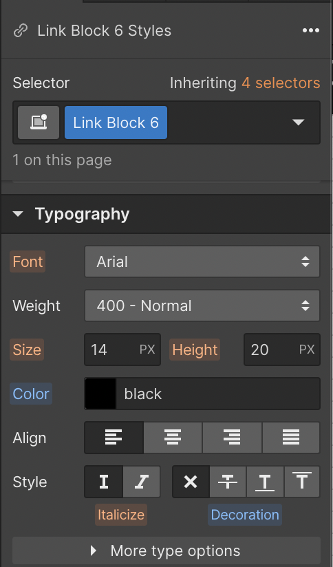

# Custom gradient border in Webflow

Create borders that pop with a gradient background and padding.

Style elements on your site using beautiful gradients. Combining the power of gradients and padding, you can style borders with a fully customizable gradient in the Webflow Designer.

In this lesson, you'll learn how to add a gradient border to your elements doing the following:

1. [Make a button from a a Link block](#make-button)
1. [Set a linear gradient background](#gradient-background)
1. [Match background color](#match-background)
1. [Add padding](#add-padding)

## Make a button from a Link block

Let's make a button so we have something to add the gradient border to. 

1. Drag a **Link block** into the document
2. Drag a **text block** and drop it inside the link block

Give the **text block** a button shape with padding.

1. Select the **text block**
2. Open **Style panel** > **Spacing**
3. Set the left and right padding to 30px
4. Set the top and bottom padding to 15px

## Set a linear gradient background

Now that we have a button to work with, we can set up the gradient border on the **Link block**.

1. Open **Style panel** > **Backgrounds**
1. Click the **Image & gradient** "plus" icon
1. Click **Linear Gradient** to set up the background gradient

## Match the background color

Apply a background color to the text box that matches the page background on the text block.

1. Open **Style panel** > **Backgrounds**
2. Set the background color of the text block to match the background color of the page (e.g., white)

## Add padding

Now, show the gradient by adding padding to the link block.

1. Open **Style panel** > **Spacing**
2. Set the same padding on all four sides

Change the typography settings on the **Link block** to make the link look more like a button. 

1. Open **Style panel** > **Typography**
2. Remove the underline decoration from the link block
3. Change the font color to black

Read more about [typography](https://university.webflow.com/lesson/advanced-typography-styles). 

Optionally, finish the button off by adding a border-radius to both the **Link block** and **text block** to round the button.

Read more about [borders](https://university.webflow.com/lesson/borders).

And that's it! A button with a gradient for a border is sure to grab the attention of your site visitors.